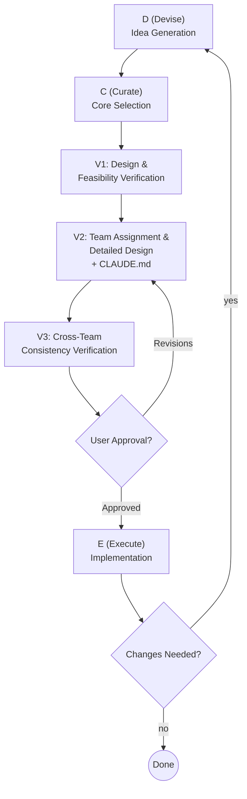

# DCVE — Devise · Curate · Verify · Execute

## Overview

A methodology for systematically cycling from idea generation through execution.
Core principle: **Run the D→C→V→E cycle. If changes arise after E, re-enter from D.**

<HARD-GATE>
Before starting, verify:
1. Confirm `CLAUDE_CODE_EXPERIMENTAL_AGENT_TEAMS` is enabled (environment variable or `env` in settings.json)
2. If disabled, STOP — inform the user that activation is required via one of:
   - Environment variable: `CLAUDE_CODE_EXPERIMENTAL_AGENT_TEAMS=1`
   - settings.json: `{"env": {"CLAUDE_CODE_EXPERIMENTAL_AGENT_TEAMS": "1"}}`
3. Proceed with the DCVE process only after confirming activation
</HARD-GATE>

## Anti-Patterns

- "I'll handle everything solo, it's faster" → Do not skip team formation for projects that warrant it
- "Skip design, just start coding" → Never skip the V phase
- "The user suggested it, let's execute immediately" → Distinguish suggestions from directives. Always confirm intent before acting

## Process Flow

**Before proceeding past V1, always ask the user about project scale and team needs.** Do not decide unilaterally. Present the scale options with a brief explanation of what each entails, and let the user choose:

- **Solo project**: Skip V2 (team assignment) and V3 (cross-team consistency), or reduce to inter-module consistency review
- **Small team**: Simplify V3 for faster iteration
- **Large project**: Execute all steps thoroughly

Even if the project appears small, explain the trade-offs (e.g., "This project could be handled solo, but forming a small team would allow domain-separated reviews. Which approach would you prefer?") and wait for the user's decision before skipping any phase.

See `checklists.md` for detailed prompts and checklists for each phase.

---

## D — Devise

**Goal**: Generate as many ideas as possible without constraints.

1. Clarify the problem to solve or the service to build
2. List all possible features, approaches, and solutions **without judgment**
3. Devise ideas evenly across user, technical, and business perspectives
4. Record every idea without omission

**Do NOT**: Evaluate ideas or assess feasibility. Do not limit quantity.

**Done when**: No new ideas emerge, or sufficiently diverse perspectives have been covered.

---

## C — Curate

**Goal**: Select the essential, core ideas from the devised pool.

1. Identify core features that directly contribute to solving the problem
2. Distinguish core vs. nice-to-have features and prioritize (impact, difficulty, dependencies, urgency)
3. Merge overlapping or combinable features
4. Define the MVP scope
5. Record deselected ideas for future reference

**Done when**: The feature list and priorities are finalized with clear criteria.

---

## V — Verify

### V1. Design & Feasibility Verification

Transform the curated spec into an implementable design.

1. Design the overall system architecture
2. Select the tech stack (with rationale)
3. Identify technical bottlenecks and risk factors
4. Review from performance, scalability, and security perspectives
5. Estimate required resources
6. If an infeasible spec is found, return to the C phase

### V2. Team Assignment & Detailed Design

Partition the overall design into domains and assign owners.

#### Team Creation Procedure

1. Define domain-specific roles needed for the project
2. Write team composition and operating rules in CLAUDE.md in the working directory (see "CLAUDE.md Authoring" section below)
   - Create CLAUDE.md if it doesn't exist; append if it does
3. Create team members in the order listed in the CLAUDE.md team composition table
4. In tmux split-pane mode, rearrange panes in table order after all members are created and apply the main-vertical layout

#### Team Member Creation Rules

- Permission mode must be **`acceptEdits`**. **Never use `bypassPermissions`** — it bypasses the user's permission policies, creating a security risk
- If document management is enabled, have each team member read the latest session_summary.md from `docs/history/` at session start to establish prior context

#### Each Owner's Responsibilities

1. Perform detailed design for their domain
2. Review feasibility of their domain
3. Derive task list, priorities, and execution order
4. Define the Definition of Done for each task
5. Document results

### V3. Cross-Team Consistency Verification

Verify that each owner's design does not conflict and align on interfaces.

1. Cross-review design documents between adjacent domains
2. Confirm interface alignment (APIs, data formats, protocols, etc.)
3. Check for differing interpretations of the same spec
4. Resolve conflicts through agreement between relevant owners
5. If agreement cannot be reached, escalate to the user with background and options
6. After a decision, update affected domain documents (including before → after change history)
7. Have relevant owners re-review the final revision

**V phase done when**: All domain designs are finalized, no unresolved conflicts remain, and documentation is complete.

---

## E — Execute

**Pre-execution final checks**:
1. All V-phase verifications are complete
2. No unresolved conflicts or pending decisions remain
3. Each owner's final task list and order are confirmed
4. **User has granted execution approval**

Proceed only after approval.

### E → D Re-entry Conditions

Re-enter the DCVE cycle when any of the following occur during execution:
- New feature request
- Existing spec requires modification
- Unexpected technical constraint discovered

On re-entry:
1. Identify the scope of impact (which domains, which owners)
2. Re-enter from D or V depending on the scope
3. Affected owners re-execute V2 → V3 → E
4. Reflect changes in existing documents with change history

---

## Team Operating Rules

### Team Leader Role
- Do not execute user commands directly — delegate to the responsible owner
- Exploration, design, and implementation are all performed by domain owners
- The team leader handles **task creation, assignment, coordination, and review only**

### User Intent Confirmation
- When the user asks for opinions or makes suggestions, **execute only after explicitly confirming their intent**
- Do not interpret questions or suggestions as immediate directives

### Team Member Shutdown
- Shut down team members **only when the user explicitly instructs it**
- Do not automatically shut down members even when work is complete

### Document Management
- Before creating team members, **ask the user first** whether to create and maintain change management documents (history.md, session_summary.md, etc.)
- If the user opts for document management:
  - The document management owner immediately updates history.md and session_summary.md upon changes
  - Include an open issues table at the bottom of each session summary

### Spec Document Review Process
1. After writing a new spec document, have each owner review their domain
2. Owners check feasibility, missing changes, and conflicts with existing code, then provide feedback
3. After reviewing their own domain, cross-review related owners' review documents
4. Verify no field name/type/structure mismatches exist at layer boundaries
5. Incorporate feedback, get user confirmation, then proceed to implementation
6. If the spec is modified, each owner re-reviews their domain and cross-reviews again (verifying previous feedback was applied correctly and checking for new issues)

---

## CLAUDE.md Authoring

During V2, when assigning owners, write the following in the working directory's CLAUDE.md.

### Required Contents

1. **Project overview**: Project name, purpose, core spec summary
2. **Team composition table**: Role name, domain, scope of responsibility (the table order determines team member creation order)
3. **Shared operating rules**: Applicable items from "Team Operating Rules" above
4. **Document structure**: Document paths and conventions used in the project (`docs/history/YYYY-MM-DD/`, etc.)

---

## Artifact Management Principles

1. **History preservation**: Record original and revised versions distinctly on every change
2. **Traceability**: Document the background and rationale for each decision
3. **Version control**: Mark the last modified date and version at the top of each document

---

## Reference

See `checklists.md` for detailed prompts (self-assessment questions) and checklists for each phase.
