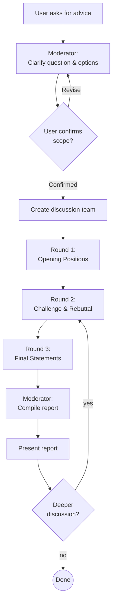

# Discuss — Multi-Perspective Discussion & Debate

## Overview

A structured discussion framework where agent team members with distinct perspectives debate a topic and produce a synthesized report.
Core principle: **Create diverse viewpoints, challenge assumptions through structured rounds, and deliver actionable synthesis.**

<HARD-GATE>
Before starting, verify:
1. Confirm `CLAUDE_CODE_EXPERIMENTAL_AGENT_TEAMS` is enabled (environment variable or `env` in settings.json)
2. If disabled, STOP — inform the user that activation is required via one of:
   - Environment variable: `CLAUDE_CODE_EXPERIMENTAL_AGENT_TEAMS=1`
   - settings.json: `{"env": {"CLAUDE_CODE_EXPERIMENTAL_AGENT_TEAMS": "1"}}`
3. Proceed only after confirming activation
</HARD-GATE>

## Anti-Patterns

- "I'll just give my own opinion" → Always use team members for diverse perspectives. A single viewpoint is not a discussion
- "Skip straight to recommendation" → Never skip the discussion rounds. The value is in the debate, not just the conclusion
- "The question is too simple for a team" → Even simple questions benefit from structured multi-angle analysis

## Process Flow



---

## Phase 1: Setup

The main agent acts as **Moderator** throughout the entire process.

1. Clarify the user's question or dilemma
2. Identify the options or positions to evaluate
3. Confirm scope with the user: What are the options? What criteria matter? Any constraints?
4. Ask the user if the default team (3 members) is sufficient or if more perspectives are needed
5. Create team members

### Team Roles

| Role | Perspective | Responsibility |
|------|------------|----------------|
| **Advocate** | Strengths & possibilities | Find the best case for each option. Highlight advantages, opportunities, and potential upside |
| **Critic** | Risks & weaknesses | Challenge assumptions. Identify risks, failure modes, hidden costs, and weaknesses for each option |
| **Synthesizer** | Balance & trade-offs | Evaluate both sides objectively. Weigh trade-offs, compare options on stated criteria, propose balanced conclusions |

**Optional roles** (user can request up to 5 total):

| Role | Perspective | When to add |
|------|------------|-------------|
| **User Advocate** | End-user/customer impact | When the decision significantly affects users or customers |
| **Pragmatist** | Implementation feasibility | When execution difficulty is a key concern |

### Team Member Creation Rules

- Permission mode must be **`acceptEdits`**. **Never use `bypassPermissions`**
- Create members in table order: Advocate → Critic → Synthesizer (→ optional roles)
- Each member receives: the user's question, the identified options, and their role-specific instructions

### Role-Specific Instructions

**Advocate prompt**:
> You are the Advocate in a structured discussion. Your role is to find and present the strongest case FOR each option. For every option discussed, identify: concrete advantages, opportunities it enables, scenarios where it excels, and evidence supporting it. Be specific — avoid vague praise. Provide at least 2 substantive strengths per option.

**Critic prompt**:
> You are the Critic in a structured discussion. Your role is to challenge assumptions and find weaknesses in each option. For every option discussed, identify: concrete risks, failure modes, hidden costs, scenarios where it breaks down, and assumptions that may not hold. Be specific — avoid vague warnings. Provide at least 2 substantive risks per option.

**Synthesizer prompt**:
> You are the Synthesizer in a structured discussion. Your role is to objectively weigh all perspectives. For every option discussed: compare trade-offs against the user's stated criteria, identify where the Advocate and Critic agree or diverge, and assess which concerns are most material. In your final statement, provide a clear recommendation with stated confidence level and conditions.

---

## Phase 2: Discussion

### Round 1 — Opening Positions

Each team member analyzes the options from their perspective:
- **Advocate**: Presents strengths of each option
- **Critic**: Presents risks and weaknesses of each option
- **Synthesizer**: Provides initial comparative analysis

The Moderator shares each member's positions with the other members before proceeding.

### Round 2 — Challenge & Rebuttal

Team members respond to each other's positions:
- **Advocate**: Rebuts the Critic's concerns — which risks are overstated? What mitigations exist?
- **Critic**: Challenges the Advocate's case — which strengths are overstated? What is being overlooked?
- **Synthesizer**: Identifies where arguments are strongest/weakest on each side, and what new information emerged

### Round 3 — Final Statements

After hearing all perspectives, each member provides their refined position:
- **Advocate**: Final assessment — which option has the strongest overall case and why
- **Critic**: Final assessment — which option has the most manageable risks and why
- **Synthesizer**: Final recommendation with confidence level and conditions

---

## Phase 3: Synthesis & Report

The Moderator compiles all perspectives into a structured report.

### Report Template

```markdown
# Discussion Report: [Topic]

## Question
[The user's original question, clearly stated]

## Options Considered
[List of options/positions that were discussed]

## Discussion Summary

### [Option A]
- **Strengths**: [Key points from Advocate]
- **Risks**: [Key points from Critic]
- **Trade-offs**: [Key points from Synthesizer]

### [Option B]
- **Strengths**: [Key points from Advocate]
- **Risks**: [Key points from Critic]
- **Trade-offs**: [Key points from Synthesizer]

## Key Agreements
[Points where all panelists aligned]

## Key Disagreements
[Points where panelists diverged, with reasoning from each side]

## Recommendation
[Synthesizer's recommendation with confidence level and conditions]

## Minority Views
[Dissenting perspectives the user should still consider]
```

After presenting the report, ask the user if they want to explore any point further.

---

## Operating Rules

### Moderator Role
- The main agent is the Moderator — it coordinates rounds, relays positions between members, and compiles the final report
- The Moderator does **not** express its own opinion — it synthesizes team output
- The Moderator ensures every team member is heard in every round

### User Intent Confirmation
- Confirm the question and scope before creating team members
- After the report, ask if the user wants deeper discussion on any specific point

### Follow-up Discussions
- If the user wants to explore a point further, re-enter Round 2 focused on that specific topic
- New options can be added — restart from Round 1 with updated scope

### Team Member Shutdown
- Shut down team members **only when the user explicitly instructs**
- Do not automatically shut down after report delivery
